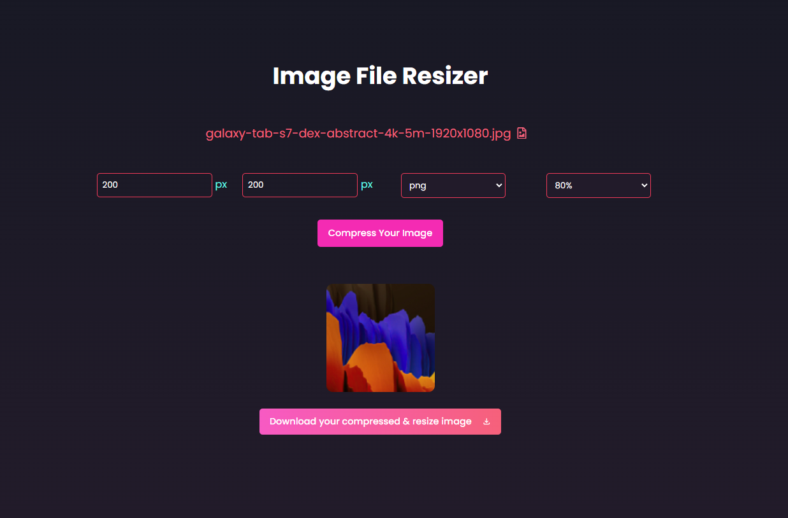

# Image File Resizer  

## Libraries & Tech Used
- React Icons :- for icons 
- React Image File Resizer :- to resize the uploaded image


## How to run locally

1. First clone for fork the repository, then in root folder install all the necessary packages using the command ```npm install```.

2. Run the server using ```npm run dev```.


### View the Live Site Here [Live Site](https://react-image-file-resizer.vercel.app/)


### React Image File Resizer

